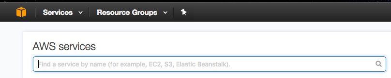
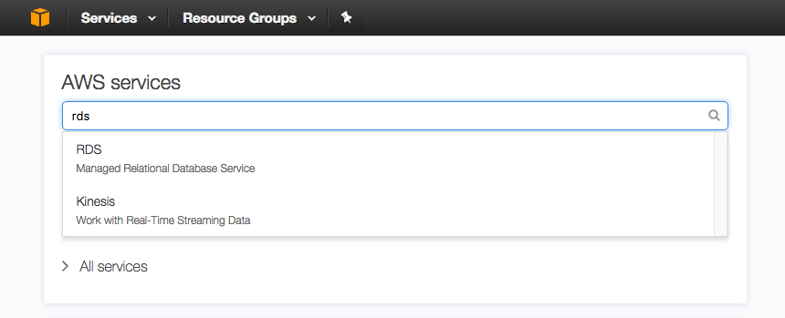
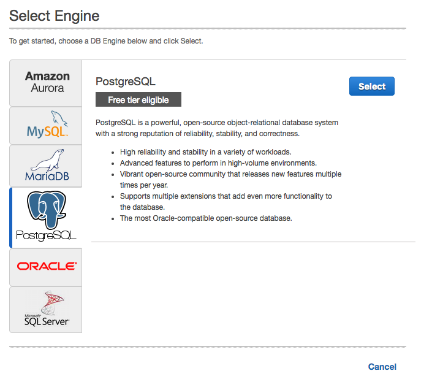
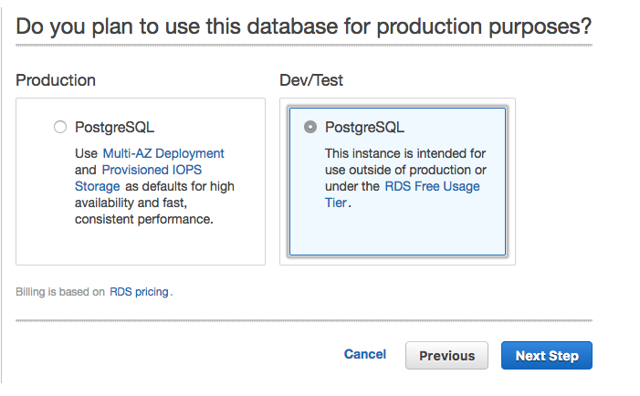
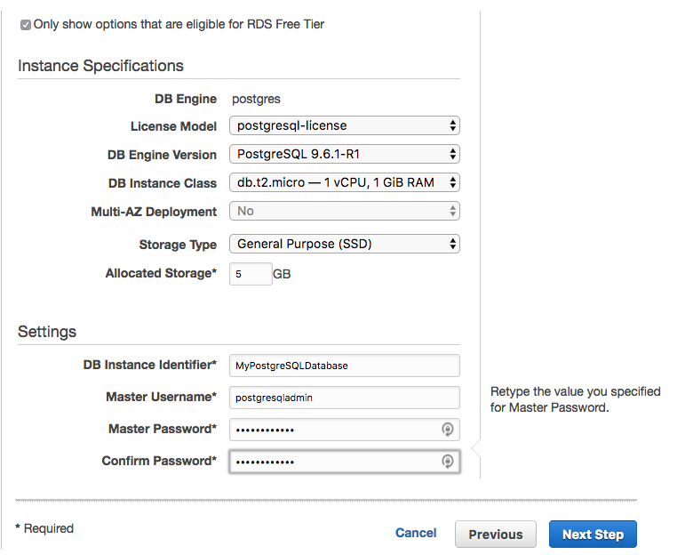
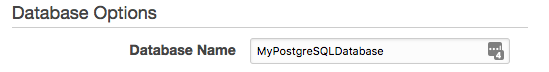

#Basic guide to creating and connecting to a PostgreSQL database on Amazon Web Services (AWS) using Relational Database Service (RDS).

Log in to console.aws.amazon.com

Click on the *services* button on the upper left

Type in *"RDS"* and click on RDS

On the left side of the screen, click on *"Instances"*. In the Instances screen, click the button labeled *"Launch DB Instance"*

On the next screen, click the *"PostgreSQL"* tab on the left. Then click the *"Select"* button in the upper right.

Click on *"Dev/Test"*. This version is eligible for free tier. _The Production option may incur charges._
Click *"Next Step"*

On the next screen, tick the checkbox labeled *"Only show options that are eligible for RDS Free Tier"*. This will prevent us from incurring any charges. You can leave the version at the default, or change to an older or newer version. I prefer going for the newest version in this case. You can leave the volume size the default for now, unless you know your database will be more than 5 GB.
Enter a name for your instance, an admin account name, and a secure password (hacking AWS is profitable, and more likely than you think. *Pick strong [passwords](https://xkcd.com/936/)!*). Click next step.

On this page, the only thing you need to change is your database name, unless you have specific settings you know you need to change or security roles already set up. Now you can click *"Launch DB Instance"*.

Return to the RDS console page. Wait for your RDS instance to spin up. This may take a few minutes. When available, copy the Endpoint URL.

Open a terminal. Using your Endpoint URL as host and your username and dbname as what you set earlier, use the following command to log in to your Postgres RDS database:

`$ psql --host=mypostgresqldatabase.chj2owuy1u24.us-west-2.rds.amazonaws.com --port=5432 --username=postgresqladmin --password dbname=MyPostgreSQLDatabase`

Note that the _password is intentionally left blank_. After you hit enter, the server will ask you for your password. Type it in and hit enter. *You are now logged in to your Postgres database!*

>Note:

>If you intend on using this database long-term (IE for more than occasional use) you will want to look into [security groups](https://docs.aws.amazon.com/AmazonRDS/latest/UserGuide/Overview.RDSSecurityGroups.htm) and roles for AWS to protect yourself and your data. Again, AWS hacking is lucrative and not unheard of, so protect yourself!
